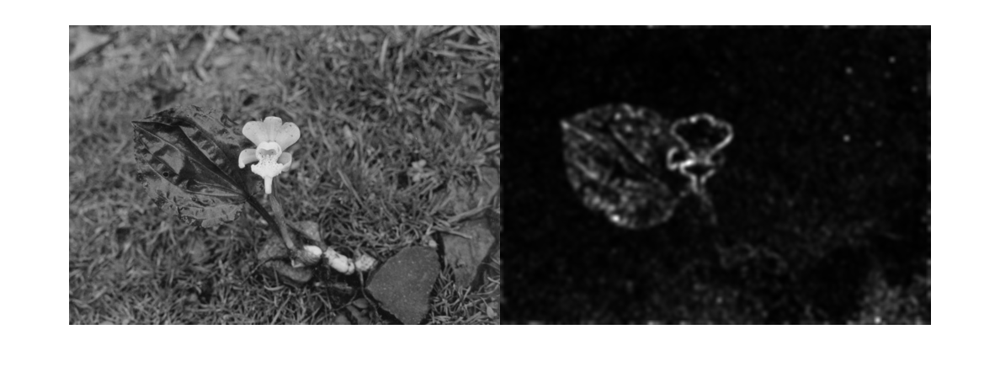

# Spectral Residual Saliency Detection


C++ port of the [MATLAB implementation](http://www.mathworks.com/matlabcentral/fileexchange/38512-visual-scanpaths-via-constrained-levy-exploration-of-a-saliency-landscape/content/CLE/saltool/SpectralR/SpectralResidualSaliency.m).


### Dependency
* OpenCV

### Reference
```
@inproceedings{
title = {Saliency Detection: A Spectral Residual Approach},
author = {Xiaodi Hou, Liqing Zhang},
booktitle={Conference on Computer Vision and Pattern Recognition (CVPR)},
year = {2007}}
```
Find this paper at www.houxiaodi.com/assets/papers/cvpr07.pdf
